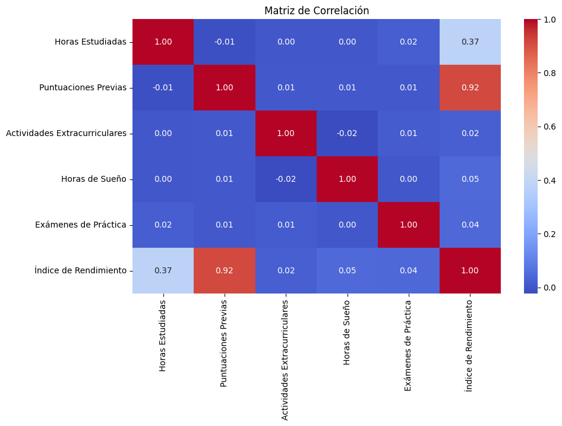
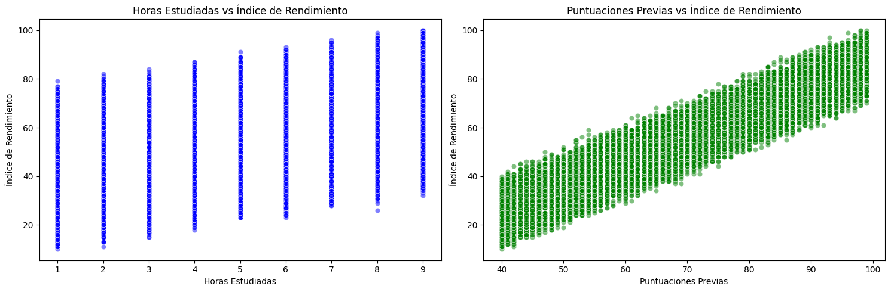
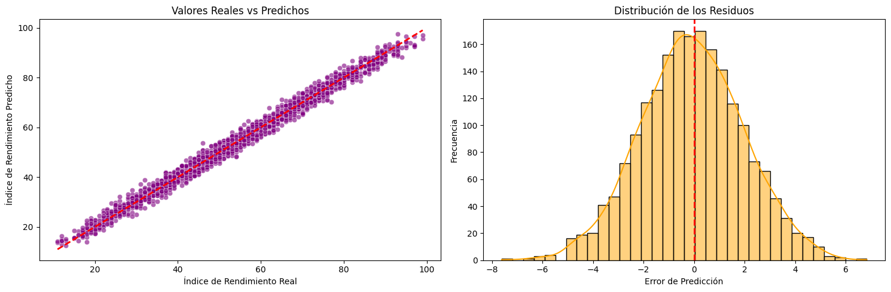

# 🎓 Predicción de Rendimiento Académico mediante Regresión Lineal Múltiple


Este repositorio contiene el **Proyecto de Medio Curso** para la asignatura de **Inteligencia Artificial**, enfocado en la aplicación práctica de algoritmos de **Aprendizaje Supervisado** para resolver problemas reales en el ámbito educativo.

---

## 👥 Datos del Grupo y Curso

*   **Curso:** Inteligencia Artificial
*   **Docente:** Yudi Guzman Monteza
*   **Grupo:** Grupo 7
*   **Integrantes:**
    *   Perez Rojas, Frey Edson
    *   Peralta Farfán, Raymond Alain
    *   Tafur Ari, Marco Alejandro
    *   Barrientos Torres, Jose Paolo

---

## 📌 Resumen del Proyecto

La identificación temprana del bajo rendimiento académico es un desafío crítico en las instituciones educativas. A menudo, las intervenciones llegan tarde, cuando el alumno ya ha reprobado un examen final o un curso completo. 

Como equipo, diseñamos e implementamos un modelo de **Machine Learning (Aprendizaje Supervisado)** diseñado para predecir el **Índice de Rendimiento** (calificación final) de un estudiante con base en sus métricas históricas y hábitos de estudio. Al anticipar estos resultados, la institución puede habilitar estrategias de tutoría personalizadas e intervenciones proactivas para prevenir el fracaso escolar.

---

## 📊 El Conjunto de Datos (Dataset)

Utilizamos un dataset de estudiantes simulados (aprox. 10,000 registros de Kaggle) que contiene 5 factores fundamentales recopilados y analizados para el entrenamiento de nuestro modelo:

| Variable | Tipo | Descripción |
| :--- | :--- | :--- |
| `Hours Studied` | Numérica | Horas dedicadas al estudio independiente. |
| `Previous Scores` | Numérica | Puntuaciones históricas del estudiante. |
| `Extracurricular Activities` | Categórica (Sí/No) | Participación en actividades extracurriculares. |
| `Sleep Hours` | Numérica | Horas de sueño diarias. |
| `Sample Question Papers Practiced` | Numérica | Cantidad de exámenes de práctica resueltos. |
| **`Performance Index`** | **Target (Continua)** | **Calificación final pronosticada (del 10 al 100).** |

---

## 🧠 Metodología: ¿Por qué Regresión Lineal Múltiple?

Para predecir una métrica continua como una calificación, existen diversos algoritmos supervisados de regresión (como Decision Trees, Random Forest o Redes Neuronales). Sin embargo, nuestro equipo determinó que en un contexto psicopedagógico la **explicabilidad del modelo es clave**. No basta con predecir una nota; necesitamos saber *por qué*.

Por ello, optamos por una **Regresión Lineal Múltiple**. Este modelo destaca por su alta interpretabilidad, ya que extrae una ecuación matemática clara que revela la ponderación exacta de cada hábito de estudio. El modelo no se comporta como una "caja negra", sino como una herramienta analítica transparente para la toma de decisiones.

---

## 📈 Visualizaciones Clave

En el análisis del proyecto, se generaron las siguientes representaciones gráficas clave para comprender la relación de los datos:

### 1. Matriz de Correlación
Análisis exploratorio grupal que muestra la fuerza y dirección de la relación entre nuestras variables predictoras y el rendimiento final.


### 2. Variables vs Rendimiento
Gráficos de dispersión que evidencian el impacto visual de las horas estudiadas y las puntuaciones previas sobre el *Performance Index*.


### 3. Distribución de Datos y Evaluación de Residuos
Evaluación colectiva del desempeño del modelo y el ajuste a los datos de prueba.


---

## 🏆 Resultados y Rendimiento del Modelo

El modelo de regresión lineal desarrollado por el grupo demostró una precisión predictiva excepcional. Tras aplicar técnicas de preprocesamiento estructurado (como el *Label Encoding* de las variables categóricas) y realizar la división de datos de entrenamiento y prueba (80/20), obtuvimos:

*   **Alto nivel de explicación ($R^2 > 0.98$):** El modelo explica más del 98% de la varianza en las calificaciones finales basándose en las 5 variables de entrada.
*   **Ecuación Predictiva Transparente:** Los coeficientes calculados permiten generar recomendaciones directas para la toma de acciones pedagógicas de manera científica.

---

## 🚀 Uso e Instalación

Para clonar y ejecutar el notebook del proyecto grupal de manera local:

1. **Clona el repositorio:**
   ```bash
   git clone https://github.com/EdsonPerez7/aprendizaje-supervizado.git
   cd aprendizaje-supervizado
   ```

2. **Instala las dependencias necesarias:**
   Es recomendable usar un entorno virtual. Las bibliotecas principales son `pandas`, `scikit-learn`, `matplotlib`, `seaborn` y `kagglehub`.
   ```bash
   pip install pandas scikit-learn matplotlib seaborn kagglehub
   ```

3. **Ejecuta el Jupyter Notebook:**
   ```bash
   jupyter notebook prediccion_rendimiento.ipynb
   ```

---

## 🛠 Herramientas Utilizadas
*   **Python 3**
*   **Scikit-Learn** (Regresión Lineal, Métricas, Preprocesamiento)
*   **Pandas** (Análisis y estructuración de datos)
*   **Matplotlib / Seaborn** (Generación de gráficos y visualizaciones)
*   **Kagglehub** (Conectividad del dataset)

---
*Este proyecto representa la entrega de medio curso del **Grupo 7**, demostrando la implementación de un flujo de Machine Learning Supervisado completo, desde el análisis exploratorio hasta la evaluación e interpretación de resultados.*
